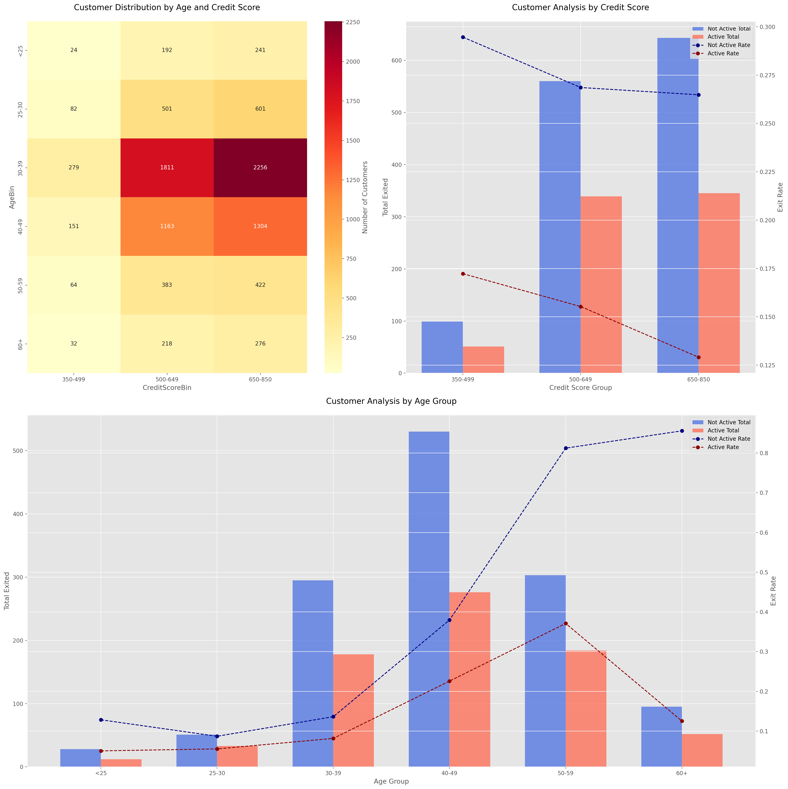

# 📊 Customer Analysis and Retention Strategy


## 📌 Project Overview
This project analyzes customer distribution, credit scores, and age groups to develop targeted retention strategies for a banking institution. The analysis focuses on identifying risk levels and providing actionable recommendations for different customer segments.

## 🎯 Key Findings

### Customer Distribution
- **Primary Segment**: Ages 30-39 with credit scores 650-850
- **Secondary Segment**: 1,811 customers in 500-649 credit score range
- **Underrepresented**: Customers <25 years and 60+ years

### Risk Analysis
#### 🔴 High Risk Segments
- Customers aged 50-59 (inactive)
- Credit scores 350-499

#### 🟡 Medium Risk Segments
- Age group 40-49 years
- Credit scores 500-649

#### 🟢 Low Risk Segments
- Customers under 30
- Credit scores 650-850

## 💡 Strategic Recommendations

### High Risk Strategy
1. Special retention program with incentives
2. Personal banking assistant assignment
3. Financial advisory services
4. Member activation campaigns

### Medium Risk Strategy
1. Loyalty rewards program
2. Service upgrades
3. Financial education & retirement planning

### Low Risk Strategy
1. Product cross-selling
2. Member referral program
3. Digital engagement enhancement

## 📈 Key Insights
- Credit score correlates negatively with exit rates
- Inactive customers show consistently higher exit rates
- Largest retention gap in low credit score range (350-499)
- Age group 50-59 shows highest exit tendency

## 🤖 Model Performance
### Training Configuration
```python
history = model.fit(
    X_train, 
    y_train,
    validation_data=(X_test, y_test),
    epochs=100,
    callbacks=[tensorflow_callback, early_stopping_callback]
)
```

### Performance Metrics
| Metric | Score |
|--------|--------|
| Accuracy | 0.7516 |
| Precision | 0.6648 |
| Recall | 0.5777 |
| F1 Score | 0.6182 |
| ROC Score | 0.8583 |

> **Note**: Model predictions use probability threshold adjustment >0.35 for binary classification
